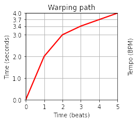
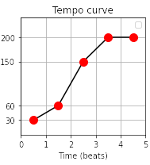
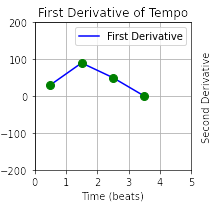
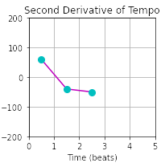
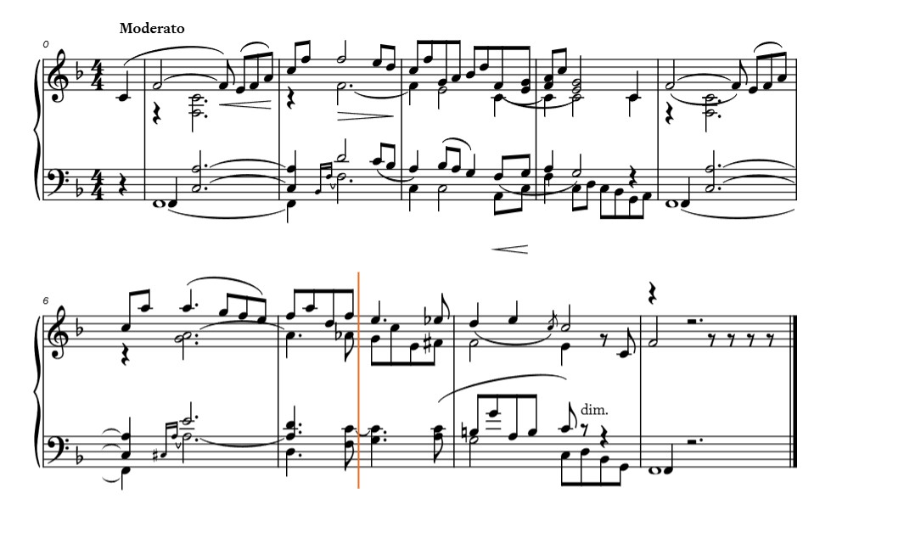
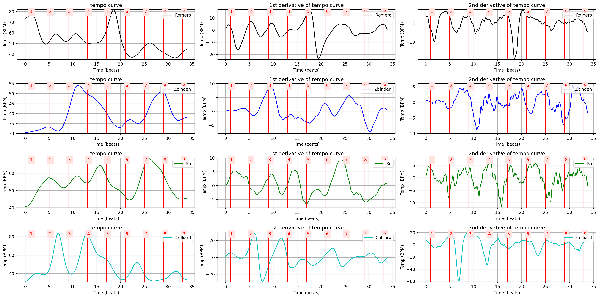
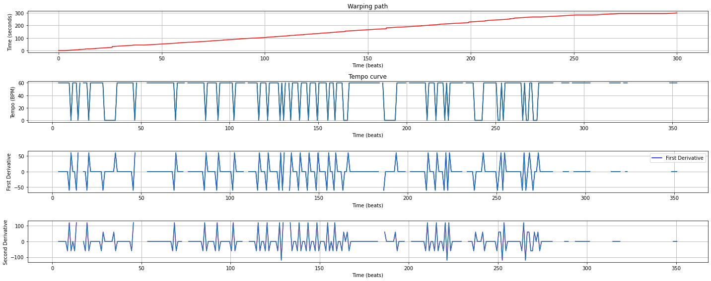

# What is the possible meaning of 2nd Derivative.
## Understanding Musical Sequences
### Presenter: Mozhgan & Behrooz
---

<toc></toc>

---

# Introduction

<v-clicks>

- **Objective**: we try to find a meaning of the 2nd derivative of tempo curve. 

- **Why**: The idea came from physics. The 2nd derivative of location chart (x) is the acceleration. so we can apply the same.  
</v-clicks>

---
layout: two-cols
---

# Dynamic Warping Path 

::right::
# Tempo

---
layout: two-cols
---

# 1st Derivative of Tempo

::right::
# 2nd Derivative

---

# Example from FMP Notebook

---

# Observations from Chart

- Points about rapid valleys leading to speed increases.
- Consistency in local valleys.
---
layout: center
---

---

# Challenges with Performers Comparison

<v-clicks>

- Issues with fluctuating tempo curves.
- Limitation in data due to only analyzing the first 30 seconds.
- Challenges with differentiation due to discontinuities.

</v-clicks>
---
layout: center
---

---

# Limitations
<v-clicks>

- Time constraints
- Conversion issues from Music XML to CSV
- Lack of comprehensive musical information

</v-clicks>
---

# Future Work

<v-clicks>

- Further comparisons between piano roll and performers.
- Exploration of datasets with more continuous tempo curves.
</v-clicks>

---

# Q&A

- Thank you note
Open for questions from the audience.